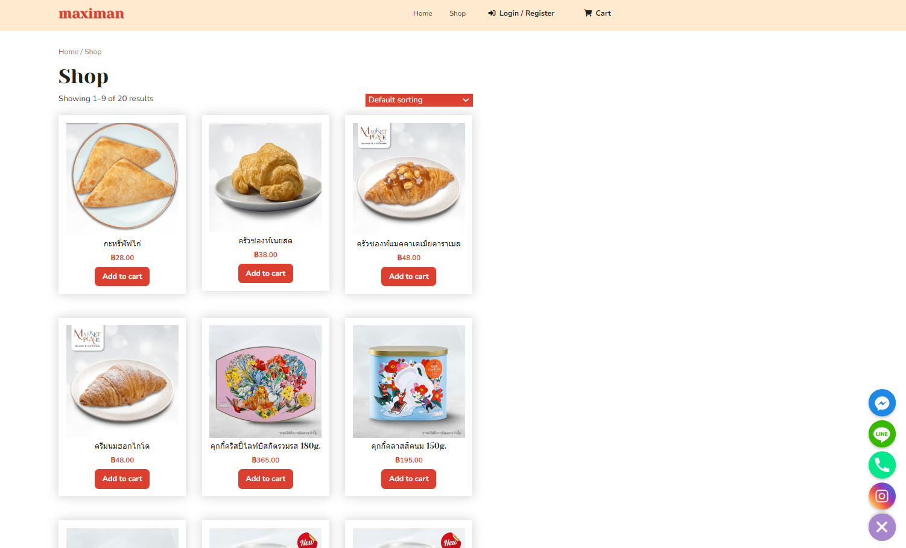
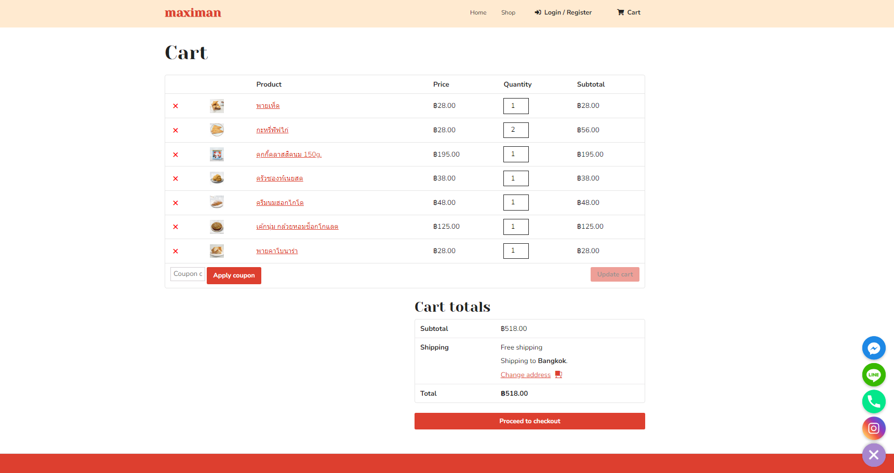
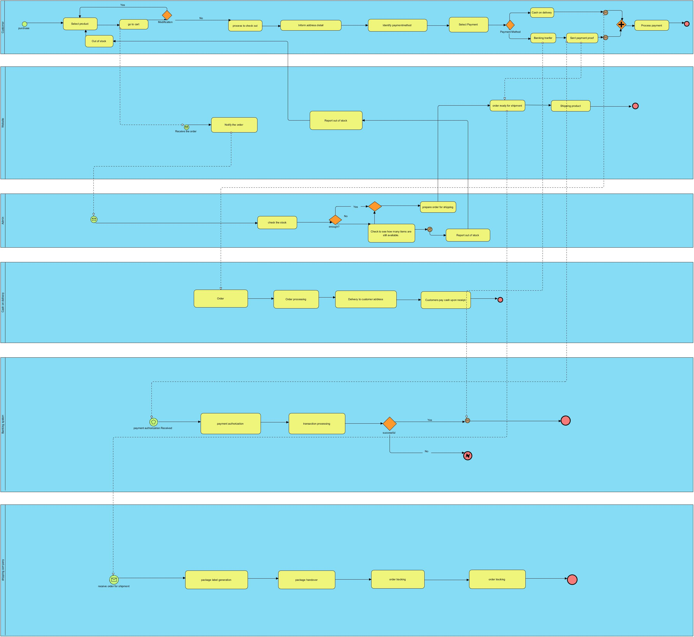
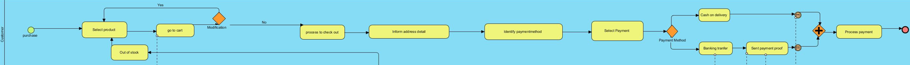
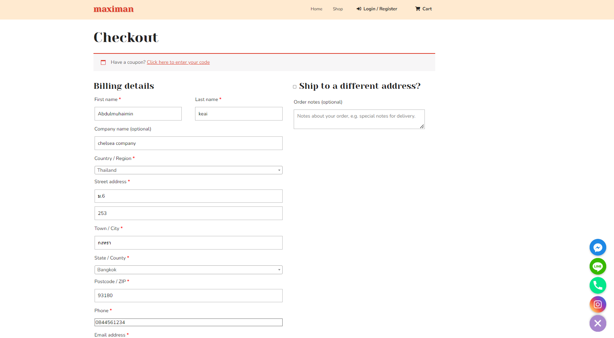
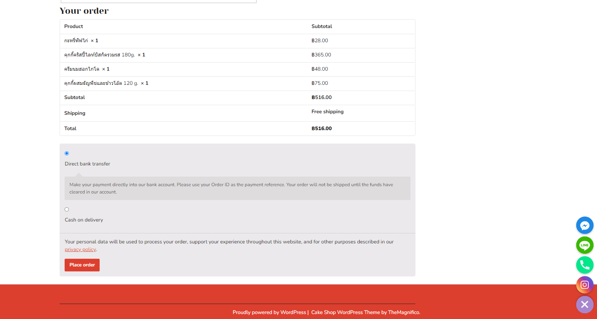
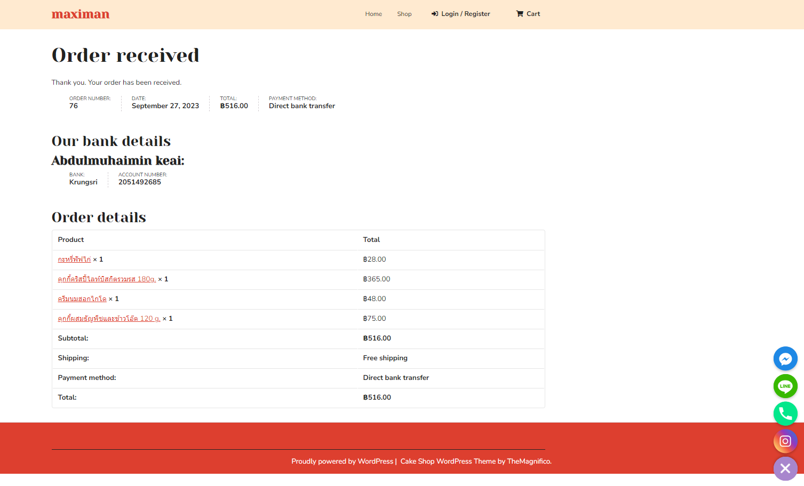
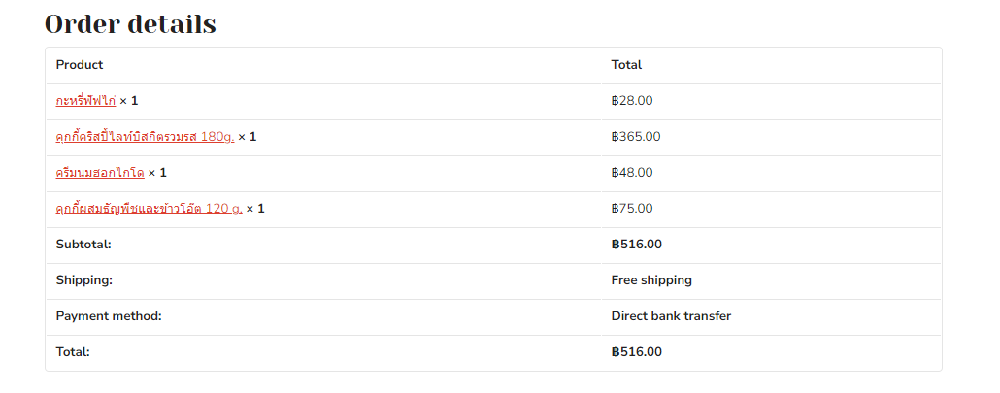
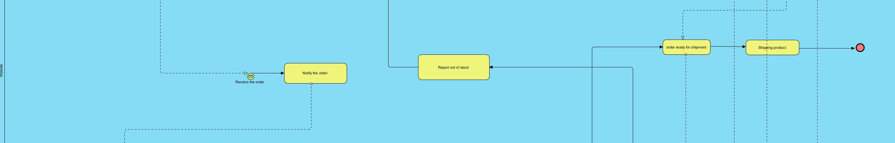
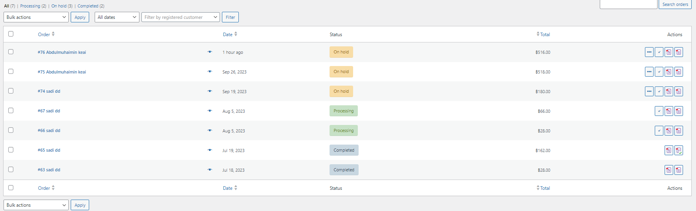

 # Modern-Ecommerce-Platforms
Design and Develop Modern Ecommerce Plafform  
Abdulmuhaimin Keai

## Abstract
A website dedicated to selling bakeries offers a delightful online destination for pastry enthusiasts and connoisseurs of baked goods. It provides a virtual bakery experience, allowing customers to explore and purchase a wide array of delectable treats from the comfort of their own homes. With a commitment to exceptional quality and craftsmanship, our website offers a tempting selection of pastries, bread, cakes, and more.

Our mission is to deliver not just baked goods but moments of pure indulgence and joy to our customers. We take pride in our attention to detail, taste, and presentation, ensuring that each bakery item is a masterpiece in itself. Whether you are craving a sweet pastry, or a custom-made cake for a special occasion, our website is your go-to destination.

Discover the world of artisanal baking at your fingertips, where every bite is a celebration of flavor, texture, and passion. Join us on this culinary journey, and savor the magic of freshly baked delights from the convenience of your screen.

## 1. Introduction
We're thrilled to announce the virtual doors of maximan Online are now wide open, inviting you to experience the irresistible world of our artisanal bakery delights from the comfort of your home.

Welcome to a realm where the aroma of freshly baked bread and the allure of decadent pastries come together to bring you a delightful online shopping journey. At maximan, we've poured our passion for baking into crafting an array of delectable treats that tickle taste buds and warm hearts.

## 2. Software and Tools Used
**2.1 Laragon:** [Laragon](https://laragon.org/why-laragon/) is utilized as our local development environment, providing a convenient platform for building and testing maximan E-Commerce Website before deployment.

**2.2 WordPress:** [WordPress](https://th.wordpress.org/) serves as the primary content management system (CMS) for our website, offering a flexible and user-friendly environment for managing web content.

**2.3 WooCommerce:** [WooCommerce](https://woocommerce.com/) is integrated seamlessly with WordPress, empowering our website with e-commerce capabilities, including product management, shopping cart functionali , and secure payment processing.

**2.4 Chaty:** [Chaty](https://wordpress.org/plugins/chaty/") is a Floating Chat Widget plugin that user can click on link to get more contact with the website

**2.5 PDF Invoices & Packing Slips for WooCommerce:**[PDF Invoices & Packing Slips for WooCommerce](https://wordpress.org/plugins/woocommerce-pdf-invoices-packing-slips/) is a plugin for the WooCommerce e-commerce platform that allows store owners to automatically generate and send PDF invoices and packing slips to customers after they place an order.

**2.6 WooCommerce PDF Invoices & Packing Slips Thai Language Pack:**[WooCommerce PDF Invoices & Packing Slips Thai Language Pack] Adds Thai font (Norasi) to WooCommerce PDF Invoices & Packing Slips.

## 3. Method

## 4. Visual Overview
- The project is about developing an E-Commerce Website for Maximan, a bakery shop. 
This platform will allow Maximan customers to browse, and buy bakery online, enhancing their shopping experience.

**HomePage**

 

**Cart**

# BPMN Diagram

This BPMN diagram show my E-Commerce Website processes 

# All Pools in BPMN
- Customer
- Website
- Admin
- Cash on delivery
- Banking system
- Shipping company

# Customer pool
 
 

**Start Buying (green circle):** This marks the beginning of the customer journey on the maximan bakery platform.

**Choose a product:** The store has a wide range of products such as croissants, cookies, cakes, and bread for customers to choose from.

 

**Choose products to add to cart:** After selecting the products you want. The customer checks in to the cart. If the customer is satisfied with the selected product They will go through the payment process. If customers still feel like they want more bakeries, they can go back to the product selection page.

 

**Customer informs address details:** 

 

**Choose payment method:** Our bakery has two payment systems for customers to choose from.Banking system and Cash on delivery.

 

**Payment Method:** The customer make a payment on what they choose  For Bank transfer, customer have to sent the payment proof to admin by using contact form to sent photo or customer can sent via instagram,messenger, Line. 
In the cash on delivery section Customers choose to pay on delivery.
After the customer receives the product The customer makes payment to the shipping company. 

           

**Customers check:** products In this section, customers will be able to check the products to see if the products they have selected are complete or not. 

## Website pool

-**Receive orders from customers from the shopping cart**

-**Receive orders from customers from the shopping cart**  

-**Notify the order to the admin to check the stock.**

-**Notification of out of stock products to customers**

-**Order ready for delivery, after which the product is sent to the transport company**

