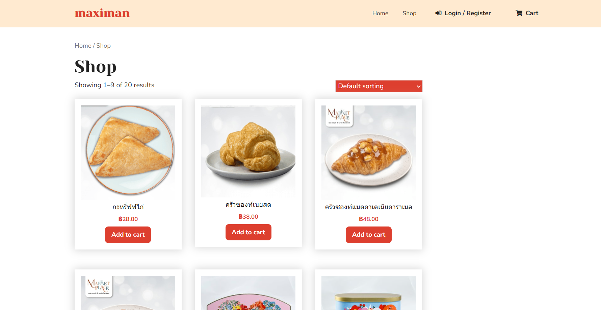
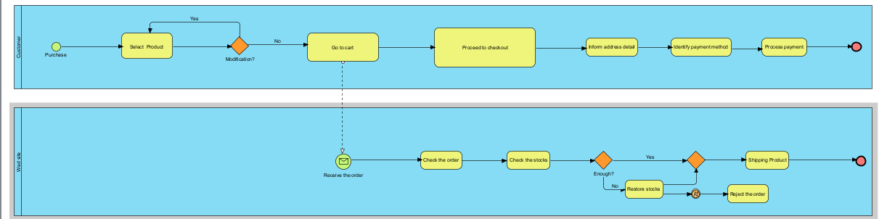

 # Modern-Ecommerce-Platforms
Design and Develop Modern Ecommerce Plafform  
Abdulmuhaimin Keai

## Abstract
A website dedicated to selling bakeries offers a delightful online destination for pastry enthusiasts and connoisseurs of baked goods. It provides a virtual bakery experience, allowing customers to explore and purchase a wide array of delectable treats from the comfort of their own homes. With a commitment to exceptional quality and craftsmanship, our website offers a tempting selection of pastries, bread, cakes, and more.

Our mission is to deliver not just baked goods but moments of pure indulgence and joy to our customers. We take pride in our attention to detail, taste, and presentation, ensuring that each bakery item is a masterpiece in itself. Whether you are craving a sweet pastry, or a custom-made cake for a special occasion, our website is your go-to destination.

Discover the world of artisanal baking at your fingertips, where every bite is a celebration of flavor, texture, and passion. Join us on this culinary journey, and savor the magic of freshly baked delights from the convenience of your screen.

## 2. Software and Tools Used
**2.1 Laragon:** [Laragon](https://laragon.org/why-laragon/) is utilized as our local development environment, providing a convenient platform for building and testing the Boo Shop E-Commerce Website before deployment.

**2.2 WordPress:** [WordPress](https://th.wordpress.org/) serves as the primary content management system (CMS) for our website, offering a flexible and user-friendly environment for managing web content.

**2.3 WooCommerce:** [WooCommerce](https://woocommerce.com/) is integrated seamlessly with WordPress, empowering our website with e-commerce capabilities, including product management, shopping cart functionali , and secure payment processing.

**2.4 Chaty:** [Chaty](https://wordpress.org/plugins/chaty/") is a Floating Chat Widget plugin that user can click on link to get more contact with the website

**2.5 PDF Invoices & Packing Slips for WooCommerce:**[PDF Invoices & Packing Slips for WooCommerce](https://wordpress.org/plugins/woocommerce-pdf-invoices-packing-slips/) is a plugin for the WooCommerce e-commerce platform that allows store owners to automatically generate and send PDF invoices and packing slips to customers after they place an order.

**2.6 WooCommerce PDF Invoices & Packing Slips Thai Language Pack:**[WooCommerce PDF Invoices & Packing Slips Thai Language Pack] Adds Thai font (Norasi) to WooCommerce PDF Invoices & Packing Slips

# Project Overview
- The project is about developing an E-Commerce Website for Maximan, a bakery shop. 
This platform will allow Maximan customers to browse, and buy bakery online, enhancing their shopping experience.

# Plugin
- PDF Invoices & Packing Slips for WooCommerce  
- WooCommerce
# Theme
- Cake Shop BakeryVersion: 1.9
By TheMagnifico52

# BPMN Diagram

- - Customers come to buy products. Then choose the products that they want.
If wanting to buy more products, go back to the previous product selection page. If you don't buy more, go to the cart.
and then check to see if the products in the cart are complete or not
proceed to payment
  Provide full address details
specify payment method Now there is only a collection of destination. 
proceed to payment
# All Pools in BPMN
- Customer
- Website
- Shipping company
